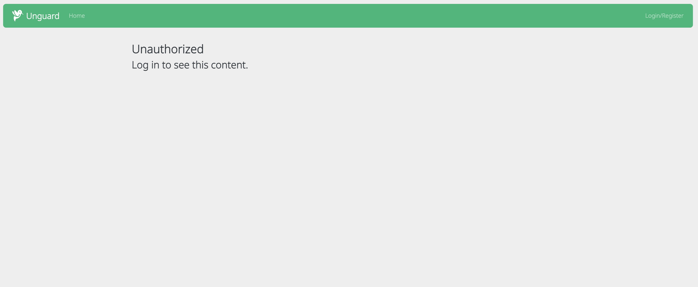
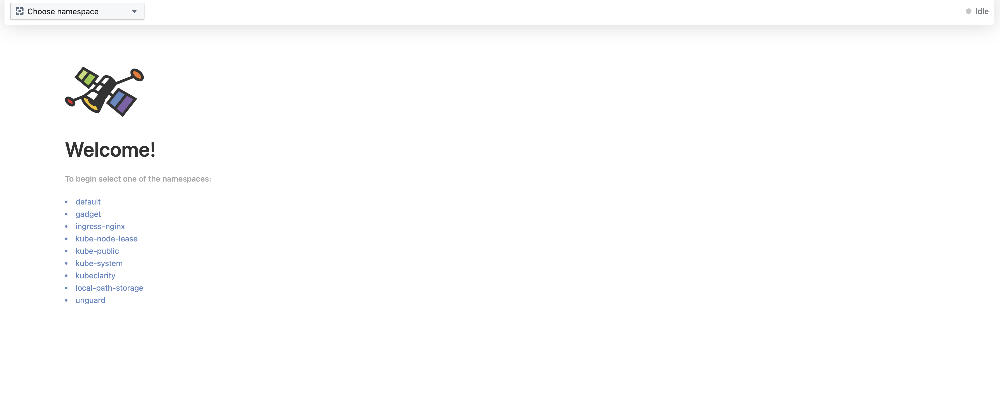
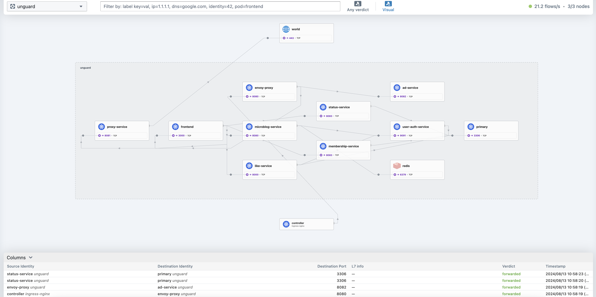

- [演習2: 演習環境のシステム構成](#演習2-演習環境のシステム構成)
  - [クラスタ情報の把握](#クラスタ情報の把握)
  - [アプリケーションの把握](#アプリケーションの把握)
  - [ノードの把握](#ノードの把握)
  - [\[チャレンジ\] クラスタコンポーネントの把握](#チャレンジ-クラスタコンポーネントの把握)

# 演習2: 演習環境のシステム構成

演習環境のクラスタを調べ、システム構成を把握しましょう。

※ コマンドと出力結果を区別するため、実行コマンドには `$ ` をプレフィックスとして付与します。

[演習環境へのアクセス方法](../ch00_setup/README.md)

## クラスタ情報の把握

クラスタに関する情報は以下のコマンドで取得できます。

```bash
$ kubectl cluster-info
Kubernetes control plane is running at https://127.0.0.1:37625
CoreDNS is running at https://127.0.0.1:37625/api/v1/namespaces/kube-system/services/kube-dns:dns/proxy

$ kubectl version
Client Version: v1.30.3
Kustomize Version: v5.0.4-0.20230601165947-6ce0bf390ce3
Server Version: v1.30.0
```

## アプリケーションの把握

`kubectl` コマンドを実行し、クラスタにデプロイされているアプリケーションを確認します。

```bash
$ kubectl get ns
NAME                 STATUS   AGE
default              Active   4d
ingress-nginx        Active   4d
kube-node-lease      Active   4d
kube-public          Active   4d
kube-system          Active   4d
kubeclarity          Active   4d
local-path-storage   Active   4d
unguard              Active   4d

$ kubectl get po -A
NAMESPACE            NAME                                                    READY   STATUS      RESTARTS         AGE
ingress-nginx        ingress-nginx-controller-74fd566899-zlrcx               1/1     Running     0                4d
kube-system          cilium-bxwpv                                            1/1     Running     0                4d
kube-system          cilium-j44r4                                            1/1     Running     0                4d
kube-system          cilium-ncsp5                                            1/1     Running     0                4d
kube-system          cilium-operator-9bfb5ffbd-klbnf                         1/1     Running     0                4d
kube-system          cilium-operator-9bfb5ffbd-wrspt                         1/1     Running     0                4d
kube-system          coredns-7db6d8ff4d-8f4ph                                1/1     Running     0                4d
kube-system          coredns-7db6d8ff4d-c74s9                                1/1     Running     0                4d
kube-system          etcd-kind-control-plane                                 1/1     Running     0                4d
kube-system          hubble-relay-7c5f6f6774-r58xj                           1/1     Running     0                4d
kube-system          hubble-ui-86f8bf6b94-sr48v                              2/2     Running     0                4d
kube-system          kube-apiserver-kind-control-plane                       1/1     Running     0                4d
kube-system          kube-controller-manager-kind-control-plane              1/1     Running     0                4d
kube-system          kube-scheduler-kind-control-plane                       1/1     Running     0                4d
kube-system          tetragon-7pgpm                                          2/2     Running     1 (4d ago)       4d
kube-system          tetragon-fxdcz                                          2/2     Running     1 (4d ago)       4d
kube-system          tetragon-ltjjn                                          2/2     Running     1 (4d ago)       4d
kube-system          tetragon-operator-84bb9bc55c-hrscz                      1/1     Running     0                4d
kubeclarity          kubeclarity-kubeclarity-8c8c479c6-6kt7g                 1/1     Running     0                4d
kubeclarity          kubeclarity-kubeclarity-grype-server-6c79f547cd-khvq5   1/1     Running     0                4d
kubeclarity          kubeclarity-kubeclarity-postgresql-0                    1/1     Running     0                4d
kubeclarity          kubeclarity-kubeclarity-sbom-db-7898bf59b-tjvnv         1/1     Running     0                4d
local-path-storage   local-path-provisioner-988d74bc-f9pd4                   1/1     Running     0                4d
unguard              attack-pod-1                                            1/1     Running     8 (27m ago)      8h
unguard              attack-pod-2                                            1/1     Running     32 (5m42s ago)   32h
unguard              unguard-ad-service-66777c45b4-99qqr                     1/1     Running     0                4d
unguard              unguard-envoy-proxy-7857f57b8d-455zv                    1/1     Running     0                4d
unguard              unguard-frontend-7f4db8769f-qft7j                       1/1     Running     0                4d
unguard              unguard-like-service-994749656-x2vtr                    1/1     Running     0                4d
unguard              unguard-mariadb-0                                       1/1     Running     0                4d
unguard              unguard-membership-service-79d7968bf6-kb4dq             1/1     Running     0                4d
unguard              unguard-microblog-service-7dd99fbf6f-bcps8              1/1     Running     0                4d
unguard              unguard-payment-service-658bfc596-p6v8x                 1/1     Running     0                4d
unguard              unguard-profile-service-599f98869d-z7lcm                1/1     Running     0                4d
unguard              unguard-proxy-service-5b84d8dd85-ubuntu                 1/1     Running     33 (5m ago)      33h
unguard              unguard-proxy-service-5b84d8dd85-xz2rr                  1/1     Running     0                4d
unguard              unguard-proxy-service-5b84d8ddxx-ubuntu                 1/1     Running     32 (32m ago)     32h
unguard              unguard-redis-5cb7cd99d7-4q48k                          1/1     Running     0                4d
unguard              unguard-status-service-85fdc644bd-764bl                 1/1     Running     0                4d
unguard              unguard-user-auth-service-dbf55bb5b-4pv7f               1/1     Running     0                4d
unguard              unguard-user-simulator-28717860-sb9gt                   1/1     Running     0                2d21h
unguard              unguard-user-simulator-28721070-fwzg2                   1/1     Running     0                16h
unguard              unguard-user-simulator-28721970-26nqk                   0/1     Completed   0                65m
unguard              unguard-user-simulator-28722000-kpmm9                   0/1     Completed   0                35m
unguard              unguard-user-simulator-28722030-gj7vz                   0/1     Completed   0                5m17s

$ kubectl get ingress -A
NAMESPACE     NAME                      CLASS   HOSTS                     ADDRESS         PORTS   AGE
kube-system   hubble-ingress            nginx   hubble.seccamp.com        10.96.200.169   80      2d14h
kubeclarity   kubeclarity-kubeclarity   nginx   kubeclarity.seccamp.com   10.96.200.169   80      4d
unguard       unguard-ingress           nginx   unguard.kube              10.96.200.169   80      4d
```

クラスタ内の Namespace と各 Namespace で実行されている Pod、Ingress の状態を確認できました。
上記コマンド以外にも色々と `kubectl` を実行してみてください。

アプリケーションの情報をまとめると以下のようになります。

| Namespace | アプリケーション | Pod 数    | ドメイン |
|----------|-----------|---------------|--------------|
| default      |    | 0         | 
| unguard      | Unguard (SNSサービス)   | 13 (シミュレーションを除く)   | unguard.kube |
| kube-system      | Cilium (CNI)<br/>Hubble (ネットワーク可視化ツール)<br/>Tetragon (プロセス監視ツール)  | 5<br/>2<br/>4         | <br/>hubble.seccamp.com<br/> |
| ingress-nginx      | Ingress コントローラ   | 1   |  |
| kubeclarity      | kubeclarity (脆弱性管理ツール)   | 4   | kubeclarity.seccamp.com |

本講義の学習シナリオにおいては、`Unguard` が自社で開発しているSNSサービスであり、それ以外はサービスに直接影響しないミドルウェア (OSS) です。

次に、Web UI を持つサービスにブラウザでアクセスしてみます。
[演習環境へのアクセス方法](../ch00_setup/README.md)に従って、ローカル環境のターミナルからポートフォワードを実行してください。

ブラウザで `unguard.kube:8081` にアクセスし、`Unguard` サービスのトップページが表示されたら成功です。



（アクセスするポート番号は、実行したポートフォワードの設定によって異なります）

画面右上の「Login/Register」からユーザーを作成し、コメント投稿やユーザーフォローなど、実装されている機能を試してみましょう。


続いて Hubble UI にアクセスしてみます。ブラウザで `hubble.seccamp.com:8081` にアクセスしてください。



画面上のリンクまたは左上のプルダウンから `unguard` を選択します。
簡易的なサービスマップが表示され、`unguard` Namespace 内のネットワークトラフィックの状況を可視化できます。



サービスを構成する各マイクロサービスがどのように通信しているのか確認してみましょう。

- クラスタ外（＝インターネット）からアクセスされるマイクロサービスは？
- マイクロサービス間の依存関係は？

## ノードの把握

```bash
$ kubectl get no -o wide
NAME                 STATUS   ROLES           AGE   VERSION   INTERNAL-IP   EXTERNAL-IP   OS-IMAGE                         KERNEL-VERSION   CONTAINER-RUNTIME
kind-control-plane   Ready    control-plane   4d    v1.30.0   172.18.0.2    <none>        Debian GNU/Linux 12 (bookworm)   6.5.0-1020-aws   containerd://1.7.15
kind-worker          Ready    <none>          4d    v1.30.0   172.18.0.3    <none>        Debian GNU/Linux 12 (bookworm)   6.5.0-1020-aws   containerd://1.7.15
kind-worker2         Ready    <none>          4d    v1.30.0   172.18.0.4    <none>        Debian GNU/Linux 12 (bookworm)   6.5.0-1020-aws   containerd://1.7.15
```

このクラスタはコントロールプレーン1台、ワーカーノード2台で構成されています。
kind のノードは docker コンテナなので、`docker` コマンドでも状況を確認することができます。

```bash
$ docker ps
CONTAINER ID   IMAGE                  COMMAND                  CREATED      STATUS      PORTS                                                                      NAMES
c7cb9f21fd8d   kindest/node:v1.30.0   "/usr/local/bin/entr…"   4 days ago   Up 4 days                                                                              kind-worker
2947a175532a   kindest/node:v1.30.0   "/usr/local/bin/entr…"   4 days ago   Up 4 days   127.0.0.1:37625->6443/tcp, 0.0.0.0:80->30080/tcp, 0.0.0.0:443->30443/tcp   kind-control-plane
e1cd372b65f4   kindest/node:v1.30.0   "/usr/local/bin/entr…"   4 days ago   Up 4 days                                                                              kind-worker2
```

コントロールプレーンのコンテナには、ローカルホストからアクセスできるようにポートフォワードが設定されています。

```
127.0.0.1:37625->6443/tcp, 0.0.0.0:80->30080/tcp, 0.0.0.0:443->30443/tcp
```

ここで、各ノードで実行されている Pod を確認してみます。

```bash
$ kubectl get po -A --field-selector spec.nodeName=kind-control-plane
NAMESPACE       NAME                                         READY   STATUS    RESTARTS        AGE
ingress-nginx   ingress-nginx-controller-74fd566899-zlrcx    1/1     Running   0               4d10h
kube-system     cilium-j44r4                                 1/1     Running   0               4d10h
kube-system     etcd-kind-control-plane                      1/1     Running   0               4d10h
kube-system     kube-apiserver-kind-control-plane            1/1     Running   0               4d10h
kube-system     kube-controller-manager-kind-control-plane   1/1     Running   0               4d10h
kube-system     kube-scheduler-kind-control-plane            1/1     Running   0               4d10h
kube-system     tetragon-ltjjn                               2/2     Running   1 (4d10h ago)   4d10h

$ kubectl get po -A --field-selector spec.nodeName=kind-worker
NAMESPACE     NAME                                    READY   STATUS      RESTARTS        AGE
kube-system   cilium-ncsp5                            1/1     Running     0               4d10h
kube-system   cilium-operator-9bfb5ffbd-klbnf         1/1     Running     0               4d10h
kube-system   tetragon-7pgpm                          2/2     Running     1 (4d10h ago)   4d10h
unguard       unguard-user-simulator-28717860-sb9gt   1/1     Running     0               3d7h
unguard       unguard-user-simulator-28721070-fwzg2   1/1     Running     0               26h
unguard       unguard-user-simulator-28722570-xjm8d   0/1     Completed   0               77m
unguard       unguard-user-simulator-28722600-cth4w   0/1     Completed   0               47m
unguard       unguard-user-simulator-28722630-tv9ss   0/1     Completed   0               17m

$ kubectl get po -A --field-selector spec.nodeName=kind-worker2
NAMESPACE            NAME                                                    READY   STATUS    RESTARTS        AGE
kube-system          cilium-bxwpv                                            1/1     Running   0               4d10h
kube-system          cilium-operator-9bfb5ffbd-wrspt                         1/1     Running   0               4d10h
kube-system          coredns-7db6d8ff4d-8f4ph                                1/1     Running   0               4d10h
kube-system          coredns-7db6d8ff4d-c74s9                                1/1     Running   0               4d10h
kube-system          hubble-relay-7c5f6f6774-r58xj                           1/1     Running   0               4d10h
kube-system          hubble-ui-86f8bf6b94-sr48v                              2/2     Running   0               4d10h
kube-system          tetragon-fxdcz                                          2/2     Running   1 (4d10h ago)   4d10h
kube-system          tetragon-operator-84bb9bc55c-hrscz                      1/1     Running   0               4d10h
kubeclarity          kubeclarity-kubeclarity-8c8c479c6-6kt7g                 1/1     Running   0               4d10h
kubeclarity          kubeclarity-kubeclarity-grype-server-6c79f547cd-khvq5   1/1     Running   0               4d10h
kubeclarity          kubeclarity-kubeclarity-postgresql-0                    1/1     Running   0               4d10h
kubeclarity          kubeclarity-kubeclarity-sbom-db-7898bf59b-tjvnv         1/1     Running   0               4d10h
local-path-storage   local-path-provisioner-988d74bc-f9pd4                   1/1     Running   0               4d10h
unguard              unguard-ad-service-66777c45b4-99qqr                     1/1     Running   0               4d10h
unguard              unguard-envoy-proxy-7857f57b8d-455zv                    1/1     Running   0               4d10h
unguard              unguard-frontend-7f4db8769f-qft7j                       1/1     Running   0               4d10h
unguard              unguard-like-service-994749656-x2vtr                    1/1     Running   0               4d10h
unguard              unguard-mariadb-0                                       1/1     Running   0               4d10h
unguard              unguard-membership-service-79d7968bf6-kb4dq             1/1     Running   0               4d10h
unguard              unguard-microblog-service-7dd99fbf6f-bcps8              1/1     Running   0               4d10h
unguard              unguard-payment-service-658bfc596-p6v8x                 1/1     Running   0               4d10h
unguard              unguard-profile-service-599f98869d-z7lcm                1/1     Running   0               4d10h
unguard              unguard-proxy-service-5b84d8dd85-xz2rr                  1/1     Running   0               4d10h
unguard              unguard-redis-5cb7cd99d7-4q48k                          1/1     Running   0               4d10h
unguard              unguard-status-service-85fdc644bd-764bl                 1/1     Running   0               4d10h
unguard              unguard-user-auth-service-dbf55bb5b-4pv7f               1/1     Running   0               4d10h
```

コントロールプレーンで実行されているのはクラスタコンポーネントと一部のミドルウェアのみであり、その他のアプリケーションはワーカーノードで実行されています。

これは `Taints` と `Tolerations` の設定によるものです。ノードに `Taints` を付与すると、対になる `Tolerations` が付与された Pod しかノードにスケジュールされなくなります。

コントロールプレーンの `Taints` は以下の通りです。

```bash
$ kubectl get no kind-control-plane -o=jsonpath='{.spec.taints}'
{"effect":"NoSchedule","key":"node-role.kubernetes.io/control-plane"}
```

`Taints` は `key` と `effect` で構成されます。

```
key: node-role.kubernetes.io/control-plane
effect: NoSchedule
```

コントロールプレーンで実行されている Pod の `Tolerations` を見ると、上記 `Taints` に該当する設定が含まれています。

```bash
$ kubectl get po -n ingress-nginx ingress-nginx-controller-74fd566899-zlrcx -o=jsonpath='{.spec.tolerations}'
[{"effect":"NoSchedule","key":"node-role.kubernetes.io/control-plane","operator":"Exists"},{"effect":"NoExecute","key":"node.kubernetes.io/not-ready","operator":"Exists","tolerationSeconds":300},{"effect":"NoExecute","key":"node.kubernetes.io/unreachable","operator":"Exists","tolerationSeconds":300}]
```

## [チャレンジ] クラスタコンポーネントの把握

クラスタコンポーネントを確認するため、コントロールプレーンのノードに入ってみます。

```bash
$ docker exec -it kind-control-plane bash

$ cat /etc/hostname
kind-control-plane
```

`ps` コマンドで、各コンポーネントの実行時にどのようなオプションが設定されているか確認できます。

```
$ ps aux | grep kube | grep -v grep | awk '{for(i=11;i<=NF;i++) printf "%s ", $i; print ""; print ""}'
kube-scheduler --authentication-kubeconfig=/etc/kubernetes/scheduler.conf --authorization-kubeconfig=/etc/kubernetes/scheduler.conf --bind-address=127.0.0.1 --kubeconfig=/etc/kubernetes/scheduler.conf --leader-elect=true

kube-controller-manager --allocate-node-cidrs=true --authentication-kubeconfig=/etc/kubernetes/controller-manager.conf --authorization-kubeconfig=/etc/kubernetes/controller-manager.conf --bind-address=127.0.0.1 --client-ca-file=/etc/kubernetes/pki/ca.crt --cluster-cidr=10.244.0.0/16 --cluster-name=kind --cluster-signing-cert-file=/etc/kubernetes/pki/ca.crt --cluster-signing-key-file=/etc/kubernetes/pki/ca.key --controllers=*,bootstrapsigner,tokencleaner --enable-hostpath-provisioner=true --kubeconfig=/etc/kubernetes/controller-manager.conf --leader-elect=true --requestheader-client-ca-file=/etc/kubernetes/pki/front-proxy-ca.crt --root-ca-file=/etc/kubernetes/pki/ca.crt --service-account-private-key-file=/etc/kubernetes/pki/sa.key --service-cluster-ip-range=10.96.0.0/16 --use-service-account-credentials=true

kube-apiserver --advertise-address=172.18.0.2 --allow-privileged=true --authorization-mode=Node,RBAC --client-ca-file=/etc/kubernetes/pki/ca.crt --enable-admission-plugins=NodeRestriction --enable-bootstrap-token-auth=true --etcd-cafile=/etc/kubernetes/pki/etcd/ca.crt --etcd-certfile=/etc/kubernetes/pki/apiserver-etcd-client.crt --etcd-keyfile=/etc/kubernetes/pki/apiserver-etcd-client.key --etcd-servers=https://127.0.0.1:2379 --kubelet-client-certificate=/etc/kubernetes/pki/apiserver-kubelet-client.crt --kubelet-client-key=/etc/kubernetes/pki/apiserver-kubelet-client.key --kubelet-preferred-address-types=InternalIP,ExternalIP,Hostname --proxy-client-cert-file=/etc/kubernetes/pki/front-proxy-client.crt --proxy-client-key-file=/etc/kubernetes/pki/front-proxy-client.key --requestheader-allowed-names=front-proxy-client --requestheader-client-ca-file=/etc/kubernetes/pki/front-proxy-ca.crt --requestheader-extra-headers-prefix=X-Remote-Extra- --requestheader-group-headers=X-Remote-Group --requestheader-username-headers=X-Remote-User --runtime-config= --secure-port=6443 --service-account-issuer=https://kubernetes.default.svc.cluster.local --service-account-key-file=/etc/kubernetes/pki/sa.pub --service-account-signing-key-file=/etc/kubernetes/pki/sa.key --service-cluster-ip-range=10.96.0.0/16 --tls-cert-file=/etc/kubernetes/pki/apiserver.crt --tls-private-key-file=/etc/kubernetes/pki/apiserver.key

etcd --advertise-client-urls=https://172.18.0.2:2379 --cert-file=/etc/kubernetes/pki/etcd/server.crt --client-cert-auth=true --data-dir=/var/lib/etcd --experimental-initial-corrupt-check=true --experimental-watch-progress-notify-interval=5s --initial-advertise-peer-urls=https://172.18.0.2:2380 --initial-cluster=kind-control-plane=https://172.18.0.2:2380 --key-file=/etc/kubernetes/pki/etcd/server.key --listen-client-urls=https://127.0.0.1:2379,https://172.18.0.2:2379 --listen-metrics-urls=http://127.0.0.1:2381 --listen-peer-urls=https://172.18.0.2:2380 --name=kind-control-plane --peer-cert-file=/etc/kubernetes/pki/etcd/peer.crt --peer-client-cert-auth=true --peer-key-file=/etc/kubernetes/pki/etcd/peer.key --peer-trusted-ca-file=/etc/kubernetes/pki/etcd/ca.crt --snapshot-count=10000 --trusted-ca-file=/etc/kubernetes/pki/etcd/ca.crt

/usr/bin/kubelet --bootstrap-kubeconfig=/etc/kubernetes/bootstrap-kubelet.conf --kubeconfig=/etc/kubernetes/kubelet.conf --config=/var/lib/kubelet/config.yaml --container-runtime-endpoint=unix:///run/containerd/containerd.sock --node-ip=172.18.0.2 --node-labels=ingress-ready=true --pod-infra-container-image=registry.k8s.io/pause:3.9 --provider-id=kind://docker/kind/kind-control-plane --runtime-cgroups=/system.slice/containerd.service
```

オプションでは主に証明書や認証情報をファイルパスで指定していますが、コンポーネントには他にも多くのオプションが用意されています。

kube-apiserver のオプション: https://kubernetes.io/docs/reference/command-line-tools-reference/kube-apiserver/

またコンテナランタイムには `containerd` が使われています。
ノード上で `docker` コマンドは利用できませんが、 `crictl` コマンドで実行コンテナの情報を確認できます。

```
$ crictl ps
CONTAINER           IMAGE               CREATED             STATE               NAME                      ATTEMPT             POD ID              POD
9179db9f453b2       ecd074983f414       4 days ago          Running             tetragon                  1                   d91d1fb481642       tetragon-ltjjn
c2f918eb475a9       ee54966f3891d       4 days ago          Running             controller                0                   e1916a31bce0f       ingress-nginx-controller-74fd566899-zlrcx
4cde28a45db41       aebfd554d3483       4 days ago          Running             cilium-agent              0                   5e0c0f5d2e9cb       cilium-j44r4
ae7b8ed88b593       acc4836f7b346       4 days ago          Running             export-stdout             0                   d91d1fb481642       tetragon-ltjjn
2dfd3610d9a4e       3861cfcd7c04c       4 days ago          Running             etcd                      0                   42e902c2ff98c       etcd-kind-control-plane
1176bf9ffbd68       7f6c51674d5ef       4 days ago          Running             kube-apiserver            0                   2c0312ae0b0e6       kube-apiserver-kind-control-plane
2ae2d93ae1481       6abc94235f022       4 days ago          Running             kube-controller-manager   0                   fb1a97b348ffc       kube-controller-manager-kind-control-plane
e98ca64cc96a2       6c97f001b028e       4 days ago          Running             kube-scheduler            0                   fdef0ea29e7ae       kube-scheduler-kind-control-plane
```

コンテナとして実行されているのは、`kubelet` を除く4つのクラスタコンポーネントです。これらは [Static Pod](https://kubernetes.io/docs/tasks/configure-pod-container/static-pod/) という仕組みで `kubelet` が実行しています。

```bash
$ ls /etc/kubernetes/manifests/
etcd.yaml  kube-apiserver.yaml  kube-controller-manager.yaml  kube-scheduler.yaml
```

上記パスのマニフェストファイルを編集すれば、`kubelet` が自動的にプロセスを再起動してくれます。

`kubelet` 自身はコンテナとして実行できないため、 `systemd` のサービスとして実行されています。

```bash
$ s /etc/systemd/system | grep kubelet
kubelet.service
kubelet.service.d
kubelet.slice

$ /etc/systemd/system/kubelet.service.d/
10-kubeadm.conf  11-kind.conf
```
